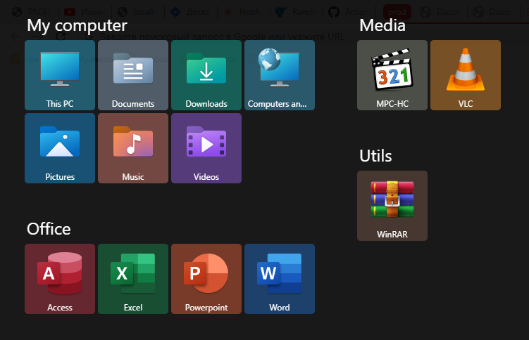

# metrome.nu

This project implements a full screen menu (like in Windows 8-10).

Install the solution from the releases section and call the menu with the Alt+Z key combination.

You can easily add, delete, move groups and elements directly in the menu window. Adding new elements (shortcuts) is done from the context menu of the files themselves.

Latest version: [1.0.0 (pre-release)](https://github.com/metrome-nu/metrome.nu/releases/download/1.0.0/metrome.nu.setup.exe)

## features
* **Embedding**: Embedding in windows explorer for files, folders and other objects to easily add items to the menu
* **Icons**: Extract quality icons for programs and folders (including support for custom icons for folders)
* **Colors**: Automatic detection of the background color for the tile based on the color of the icon

## todo
* **Layout**: Using grid-layout with the ability to place icons on the grid, and not just one after the other
* **Customization**: Full appearance customization (including size, padding, colors, etc.)
* **Zoom**: Changing the scale of the menu (and automatic substring of the scale to the monitor)
* **Monitor**: Support for two or more monitor configurations
